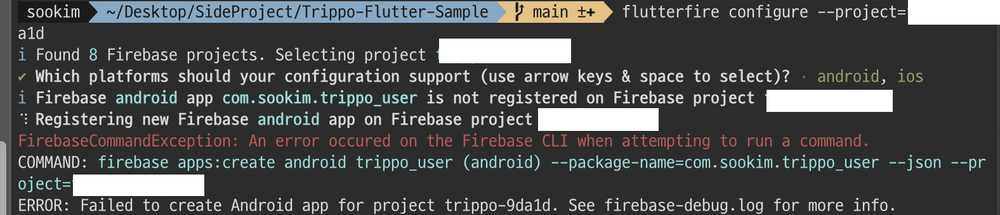

## 🚘 Trippo 프로젝트 요약
---

- **강의 갯수**: 1강 ~ 20강
- **프로젝트 실행방법**: Firebase, Google Cloud Console 설정 필요


### [Flutter - Trippo Ride Sharing App (Uber Clone) - Introduction [Part-1]](https://www.youtube.com/watch?v=aBXKBvCSAMI&list=PL2OW6kiTqhAw2e9YlaxHzK0j8UWoswgJF&index=1)
---

1. 프로젝트 소개


### [Flutter - Trippo Ride Sharing App (Uber Clone) - Creating Users App [Part-2]](https://www.youtube.com/watch?v=QulrWYPUZCY&list=PL2OW6kiTqhAw2e9YlaxHzK0j8UWoswgJF&index=2)
---

1. Flutter 프로젝트 생성
2. 다크모드 지원방법 - theme_provider.dart
    - main.dart의 ThemeData는 primarySwatch에서 colorScheme으로 변경됨
    - [Replace `primarySwatch` with `ColorScheme.fromSeed` in the ...](https://github.com/flutter/website/issues/9713)

3. 회원가입 UI 구현 - register_screen.dart
    - email_validator 로 이메일 유효성 검증
    - intl_phone_field 로 전화번호 필드 구현

4. Firebase 설정 (Flutter)
    - [Flutter Firebase 연동 - 블로그](https://www.kyulabs.app/027bf981-c36a-42cb-b016-8d5d06526812)

<details>
<summary>상세</summary>

<!-- summary 아래 한칸 공백 두어야함 -->
1. Firebase 프로젝트생성
2. ```$ firebase login```
3. ```$ dart pub global activate flutterfire_cli```
4. ```$ flutterfire configure --project=YOUR_PROJECT_ID```
    - flutterfire command not found 에러 발생시 zsh 환경설정 진행
    - flutterfire configure 안되면 미리생성한 앱이있는지 확인
    
5. main.dart에 초기화 코드 추가
    ```dart
    Future<void> main() async {
      WidgetsFlutterBinding.ensureInitialized();
      await Firebase.initializeApp(options: DefaultFirebaseOptions.currentPlatform);
      runApp(const MyApp());
    }
    ```
</details>

### [Flutter - Trippo Ride Sharing App (Uber Clone) - Register, Login and Forgot Password [Part-3]](https://www.youtube.com/watch?v=28TxUijyugY&list=PL2OW6kiTqhAw2e9YlaxHzK0j8UWoswgJF&index=3)
---

1. Firebase 초기 설정

패키지 추가
```yaml
  firebase_core: ^3.12.1
  firebase_messaging: ^15.2.4
  firebase_auth: ^5.5.1
  firebase_database: ^11.3.4
  firebase_storage: ^12.4.4
```

app/build.gradle에 minSdkVersion 21이상으로 변경
```
...

defaultConfig {
    applicationId = "com.sookim.trippoUser"
    minSdk = 26
    
    ...
```

2. FirebaseAuth 
    1. Firebase콘솔에서 이메일/비밀번호 추가
    2. 회원가입 createUserWithEmailAndPassword 함수 - register_screen.dart (submit 함수)
    3. 로그인 signInWithEmailAndPassword 함수 - login_screen.dart (submit 함수)
    4. 로그인 여부 확인 - splash_screen.dart (readCurrentOnlineUserInfo 함수)
    5. 비밀번호 변경 sendPasswordResetEmail 함수 - forgot_password_screen.dart (submit 함수)


3. FirebaseRealTimeDB 추가 

규칙설정

```
{
  "rules": {
    ".read": true,
    ".write": true
  }
}
```

### [Flutter - Trippo Ride Sharing App (Uber Clone) - Enabling API and adding Google Map [Part-4]](https://www.youtube.com/watch?v=kwPYbXhwz6U&list=PL2OW6kiTqhAw2e9YlaxHzK0j8UWoswgJF&index=4)
---

1. [구글 클라우드 콘솔](https://console.cloud.google.com/) 사용할 API 선택 - (🚨주의할점 : 한국에서는 정확히 경로검색등이 제공안됨)
    - [Maps SDK for Android](https://console.cloud.google.com/marketplace/product/google/maps-android-backend.googleapis.com?q=search&referrer=search&inv=1&invt=AbtfBQ&project=trippo-9da1d)
    - [Maps SDK for iOS](https://console.cloud.google.com/marketplace/product/google/maps-ios-backend.googleapis.com?q=search&referrer=search&inv=1&invt=AbtfBQ&project=trippo-9da1d)
    - [Places API](https://console.cloud.google.com/marketplace/product/google/places-backend.googleapis.com?q=search&referrer=search&inv=1&invt=AbtfBQ&project=trippo-9da1d&supportedpurview=project)
    - [Places API (New)](https://console.cloud.google.com/marketplace/product/google/places.googleapis.com?q=search&referrer=search&inv=1&invt=AbtfBQ&project=trippo-9da1d&supportedpurview=project)
    - [Directions API](https://console.cloud.google.com/marketplace/product/google/directions-backend.googleapis.com?q=search&referrer=search&inv=1&invt=AbtfBQ&project=trippo-9da1d&supportedpurview=project)
    - [Geocoding API](https://console.cloud.google.com/marketplace/product/google/geocoding-backend.googleapis.com?q=search&referrer=search&inv=1&invt=AbtfBQ&project=trippo-9da1d&supportedpurview=project)
    - [Roads API](https://console.cloud.google.com/marketplace/product/google/roads.googleapis.com?q=search&referrer=search&inv=1&invt=AbtfBQ&project=trippo-9da1d&supportedpurview=project)
    - [Geolocation API](https://console.cloud.google.com/marketplace/product/google/geolocation.googleapis.com?q=search&referrer=search&inv=1&invt=AbtfBQ&project=trippo-9da1d&supportedpurview=project)

현재는 Billing Account 생성 후 사용가능

API Key 사용가능한 서비스 모두 설정


2. google_maps_flutter 구글맵 설정
- 패키지 추가

- android/app/src/main/AndroidManifest.xml에 아래 코드 추가 키값은 위에 APIKey설정
```
<meta-data android:name="com.google.android.geo.API_KEY"
    android:value="자신의 APIKEY 입력"/>
```

- iOS AppDelegate.swift 아래 코드 추가
```swift
@objc class AppDelegate: FlutterAppDelegate {
  override func application(
    _ application: UIApplication,
    didFinishLaunchingWithOptions launchOptions: [UIApplication.LaunchOptionsKey: Any]?
  ) -> Bool {
    GMSServices.provideAPIKey("자신의 APIKEY 입력")
    ...
```

3. 위치 권한 요청하기
    - geolocator 패키지로 권한 요청하기 - main_screen.dart 의 checkIfLocationPermissionAllowed() 함수

4. 현재 기기 위치 가져오기
    - geolocator 패키지로 좌표 가져오기 - main_screen.dart 의 locateUserPosition() 함수

5. 특정좌표 reverseGeocoding
    - Google Geocoding API로 정보 가져오기 - assistant_methods.dart 의 searchAddressForGeographicCoordinates() 함수

6. http 패키지 네트워킹
    - request_assistant.dart 활용 부분

### [Flutter - Trippo Ride Sharing App (Uber Clone) - Provider, Search and Set Dropoff location [Part-5]](https://www.youtube.com/watch?v=aPn-K70CKCk&list=PL2OW6kiTqhAw2e9YlaxHzK0j8UWoswgJF&index=5)
---
요약 -> 첫 화면에서 핀 이동해서 리버스지오코딩 하기, 상단 표시하는 부분 제거하고 출발지 선택시 이동하는 위젯으로 변경, 검색화면 구현

1. Provider 설정 방법 - 전역 Provider (app_info.dart)
2. 맵 첫 지도화면 구현 - main.dart의 // UI for Searching Location 위젯 
3. 검색화면 UI 구현 - place_prediction_tile.dart, search_places_screen.dart, predicted_places.dart

Column 내부에서 ListView 사용할 때는 Expanded 위젯으로 감싸야 합니다.

4. ElevatedButton의 styleFrom의 매개변수 중 primary는 배경색, onPrimary는 텍스트색상인데 각각 backgroundColor, foregroundColor로 대체되었다.

### [Flutter - Trippo Ride Sharing App (Uber Clone) - Get Places Direction Details [Part-6]](https://www.youtube.com/watch?v=wt9w9LhxhiM&list=PL2OW6kiTqhAw2e9YlaxHzK0j8UWoswgJF&index=6)
---
요약 -> 검색화면 마무리 - 아이템 선택시 처리 구현, POI API 호출

1. 로딩 인디케이터 구현 - progress_dialog
2. pop 하면서 데이터 처리 - 아이템선택시 처리 'obtainedDropOff' 


### [Flutter - Trippo Ride Sharing App (Uber Clone) - Draw Polyline from Origin to Destination [Part-7]](https://www.youtube.com/watch?v=xzrg1hYBO1A&list=PL2OW6kiTqhAw2e9YlaxHzK0j8UWoswgJF&index=7)
---
요약 -> 경로조회 지도 화면 구현

1. 지도 polyline 설정 - assistant_method.dart(obtainOriginToDestinationDirectionDetails 함수), direction_details_info.dart, main_screen.dart의 drawPolyLineFromOriginToDestination 함수
2. 지도 마커 설정 - main_screen.dart의 drawPolyLineFromOriginToDestination 함수
3. 지도 원 circle 설정 - main_screen.dart의 drawPolyLineFromOriginToDestination 함수


### [Flutter - Trippo Ride Sharing App (Uber Clone) - Precise Pickup Location and Drawer [Part-8]](https://www.youtube.com/watch?v=8mi6RVNEKHA&list=PL2OW6kiTqhAw2e9YlaxHzK0j8UWoswgJF&index=8)
---
요약 -> 지도에서 출발지 설정화면으로 분리, 사이드메뉴 구현, 프로필화면 구현, Firebase RealTimeDB 데이터 업데이트

1. main_screen.dart에서 출발지 설정하는 부분 precise_pickup_location.dart로 분리
2. 사이드메뉴 구현 - drawer_screen.dart
3. 프로필 화면 구현 - RealTimeDB 업데이트 profile_screen.dart


### [Flutter - Trippo Ride Sharing App (Uber Clone) - Creating Drivers App [Part-9]](https://www.youtube.com/watch?v=HF-g1bLlwbg&list=PL2OW6kiTqhAw2e9YlaxHzK0j8UWoswgJF&index=9)
---
요약 -> 기사앱 초기설정 (pubspec.yaml, firebase, 에셋 등등), 회원가입, 로그인 테이블 users가 아닌 drivers로 변경, 기사 회원가입시 car_details 테이블 추가

1. 기사앱 프로젝트 생성 trippo_driver (Firebase 추가)
2. 기사앱 라이더앱 login하는 경우 currentUser 저장 - (login_screen.dart의 _submit() 함수 then 부분)
3. 기사앱 가입시 차량정보 저장 - drivers 테이블


### [Flutter - Trippo Ride Sharing App (Uber Clone) - Adding Google Map in our Drivers App [Part-10]](https://www.youtube.com/watch?v=7XF_ozl39PI&list=PL2OW6kiTqhAw2e9YlaxHzK0j8UWoswgJF&index=10)
---
요약 -> 기사앱 홈화면 구현 (탭바 구현)

1. 기사앱 main_screen.dart TabController -> 탭바 구현 
2. main_screen.dart 위젯 SingleTickerProviderStateMixin 상속
3. home_tab - driver_data.dart 드라이버 모델 생성, 현재 정보 저장 readCurrentDriverInfomation(), Geofire, StreamSubscription를 사용해서 실시간 기사 위치 처리, 기사 온오프라인 상태 처리 
Online 상태일 때 RealtimeDB에 activeDrivers 추가되고 newRideStatus idle 처리가됨,
Offline 상태일 때 RealtimeDB에 activeDrivers 삭제되고 newRideStatus idle 삭제됨, 

RealTimeDB 규칙 수정
```
{
  "rules": {
    ".read": true,
    ".write": true,
      "activeDrivers": {
        ".indexOn": ["g"]
      }
  }
}
```
 

### [Flutter - Trippo Ride Sharing App (Uber Clone) - Adding GeoFire to locate drivers on Users [Part-11]](https://www.youtube.com/watch?v=hwo4xuuXrT8&list=PL2OW6kiTqhAw2e9YlaxHzK0j8UWoswgJF&index=11)
---
요약 -> 라이더앱 기사 마커 실시간 표시

1. 라이더앱에서 Geofire로 현재 기사 정보 가져오기 - main_screen.dart 의 initializeGeoFireListener(), displayActiveDriversOnUsersMap(), active_nearby_available_drivers.dart, geofire_assistant.dart


### [Flutter - Trippo Ride Sharing App (Uber Clone) - Show Fare Screen on Users App [Part-12]](https://www.youtube.com/watch?v=JNfx9m7Lm2k&list=PL2OW6kiTqhAw2e9YlaxHzK0j8UWoswgJF&index=12)
---

요약 -> 라이더앱 호출 요청화면 구현

1. main_screen.dart - showSuggestedRidesContainer() 요금선택 버튼 클릭, 요금선택 위젯 ui for suggested rides 주석
2. 예상요금 계산 USD, 킬로미터 등 - assistant_methods.dart의 calculateFareAmountFromOriginToDestination() 함수
3. 총 라이더 여정상태별 처리 함수 - RealtimeDB 추가 main_screen.dart의 saveRideRequestInformation() 함수


### [Flutter - Trippo Ride Sharing App (Uber Clone) - User Ride Request Information [Part-13]](https://www.youtube.com/watch?v=vpMfBG6eiB4&list=PL2OW6kiTqhAw2e9YlaxHzK0j8UWoswgJF&index=13)
---
요약 -> 라이더앱 호출로직 파트 12에서 이어서

1. main_screen.dart - 기사와 유저 출발지 시간 확인 updateArrivalTimeToUserPickUpLocation(), 출발지 도착지 시간 확인 updateReachingTimeToUserDropOffLocation(), searchNearestOnlineDrivers(), retrieveOnlineDriversInformation(),  요금선택 버튼 클릭, 요금선택 위젯 ui for suggested rides 주석

### [Flutter - Trippo Ride Sharing App (Uber Clone) - Send Push Notification to Driver 1 [Part-14]](https://www.youtube.com/watch?v=dGu1UeMLTAs&list=PL2OW6kiTqhAw2e9YlaxHzK0j8UWoswgJF&index=14)
---
요약 -> 호출 시 유저가 기사에게 FCM 호출 AssistantMethods.sendNotificationToDriverNow, 기사가 FCM 호출 수신
 

1-1. Cloud Messaging API - Legacy 방법 - main_screen.dart의 AssistantMethods.legacySendNotificationToDriverNow 호출 부분
1-2. Http v1 방법 (Cloud Messaging API 호출 방식은 http v1 으로 마이그레이션 해야됨)  - main_screen.dart의 AssistantMethods.sendNotificationToDriverNow 호출 부분

[FCM HTTP v1](https://www.youtube.com/watch?v=X3i9SErMGD0)

<details>
<summary>상세</summary>

<!-- summary 아래 한칸 공백 두어야함 -->
1. Firebase Console 프로젝트 설정 -> 클라우드 메시징 -> 서비스 계정 관리
2. 서비스 계정 만들기 -> 키 추가 -> JSON 저장
3. googleapis: ^14.0.0, googleapis_auth: ^1.4.1 패키지 추가
4. 유저앱 -> assistant_methods.dart의 getAccessToken(), sendNotificationToDriverNow() 체크
</details>


2. Google Cloud Console - [Firebase Cloud Messaging API](https://console.cloud.google.com/marketplace/product/google/fcm.googleapis.com) 활성화, 되어있으면 Firebase Console에서 프로젝트 설정에서 키값 확인
3. 기사앱 notification_dialog_box.dart, push_notification_system.dart 추가 및 AndroidManifest.xml의 인텐트 필터 추가 

```
<intent-filter>
    <action android:name="FLUTTER_NOTIFICATION_CLICK"/>
    <category android:name="android.intent.category.DEFAULT"/>
</intent-filter>
```


> 오류 수정
audioPlayer 오류로 일단 주석 처리

- Unknown jvmTarget 21 →
    1. Ladybug 안드로이드 스튜디오 문제?
    2. https://stackoverflow.com/questions/79012911/unknown-kotlin-jvm-target-21-flutter-build-error-in-beginner-project
    3. https://medium.com/@naeem0313/fixing-unknown-kotlin-jvm-target-21-android-studio-ladybug-debugging-ef8242802b3e
    
    ```swift
    FAILURE: Build failed with an exception.
    
    * What went wrong:
    Execution failed for task ':assets_audio_player_web:compileDebugKotlin'.
    > Error while evaluating property 'compilerOptions.jvmTarget' of task ':assets_audio_player_web:compileDebugKotlin'.
       > Failed to calculate the value of property 'jvmTarget'.
          > Unknown Kotlin JVM target: 21
    
    * Try:
    > Run with --stacktrace option to get the stack trace.
    > Run with --info or --debug option to get more log output.
    > Run with --scan to get full insights.
    > Get more help at https://help.gradle.org.
    
    BUILD FAILED in 12m 36s
    Error: Gradle task assembleDebug failed with exit code 1
    ```
    
    ```swift
    FAILURE: Build failed with an exception.
    
    * What went wrong:
    Execution failed for task ':assets_audio_player_web:compileDebugKotlin'.
    > Inconsistent JVM-target compatibility detected for tasks 'compileDebugJavaWithJavac' (1.8) and 'compileDebugKotlin' (21).
    
      Consider using JVM Toolchain: https://kotl.in/gradle/jvm/toolchain
      Learn more about JVM-target validation: https://kotl.in/gradle/jvm/target-validation 
    
    * Try:
    > Run with --stacktrace option to get the stack trace.
    > Run with --info or --debug option to get more log output.
    > Run with --scan to get full insights.
    > Get more help at https://help.gradle.org.
    
    BUILD FAILED in 2m 35s
    Error: Gradle task assembleDebug failed with exit code 1
    ```

### [Flutter - Trippo Ride Sharing App (Uber Clone) - Send Push Notification to Driver 2 [Part-15]](https://www.youtube.com/watch?v=1bRW7LyAPgM&list=PL2OW6kiTqhAw2e9YlaxHzK0j8UWoswgJF&index=15)
---

요약 -> 기사가 FCM 호출 수신했을 때 처리 파트 14 이어서 진행


1. 기사앱 home_tab.dart - PushNotification 생성, 토큰 처리
2. 유저앱 pay_fare_amount_dialog.dart 생성, main_screen.dart의 // Requesting a ride 주석 위젯
3. notification_dialog_box.dart 


### [Flutter - Trippo Ride Sharing App (Uber Clone) - Driver new trip screen [Part-16]](https://www.youtube.com/watch?v=mM8F-_Jsfm0&list=PL2OW6kiTqhAw2e9YlaxHzK0j8UWoswgJF&index=16)
---

요약 -> 기사 수락화면 구현 마무리
1. 기사앱 new_trip_screen.dart - UI 마무리 


### [Flutter - Trippo Ride Sharing App (Uber Clone) - Driver's info in User's App [Part-17]](https://www.youtube.com/watch?v=YOVzLAn6oF0&list=PL2OW6kiTqhAw2e9YlaxHzK0j8UWoswgJF&index=17)
---

요약 -> 기사 출발지도착, 유저 여정 중화면 구현
1. new_trip_screen.dart - 기사 출발지도착, 여정시작, 여정완료, 기사 요금 계산 로직 구현 
2. fare_amount_collection_dialog.dart - 기사 요금계산 UI 구현
3. 유저 여정 중 화면 구현 - main_screen.dart 의 // UI For displaying assigned driver information 주석 위젯
4. 유저 결제 영수증 구현 - pay_fare_amount_dialog.dart


### [Flutter - Trippo Ride Sharing App (Uber Clone) - Rate Driver Screen [Part-18]](https://www.youtube.com/watch?v=9vmcl5Fhgfw&list=PL2OW6kiTqhAw2e9YlaxHzK0j8UWoswgJF&index=18)
---
요약 -> 기사 평가처리 유저 적용, 여정내역 처리

1. 기사 평가 ratings 저장
2. 유저앱 rate_driver_screen.dart 작성
3. trips_history_model, app_info.dart의 tripsHistory, assistant_methods.dart의 readTripKeysForOnlineUser 함수


### [Flutter - Trippo Ride Sharing App (Uber Clone) - User's Trips History [Part-19]](https://www.youtube.com/watch?v=cPu3Fof6o_A&list=PL2OW6kiTqhAw2e9YlaxHzK0j8UWoswgJF&index=19)
---

### [Flutter - Trippo Ride Sharing App (Uber Clone) - Driver's earnings and ratings [Part-20]](https://www.youtube.com/watch?v=bZv0Beq2n9M&list=PL2OW6kiTqhAw2e9YlaxHzK0j8UWoswgJF&index=20)
---

